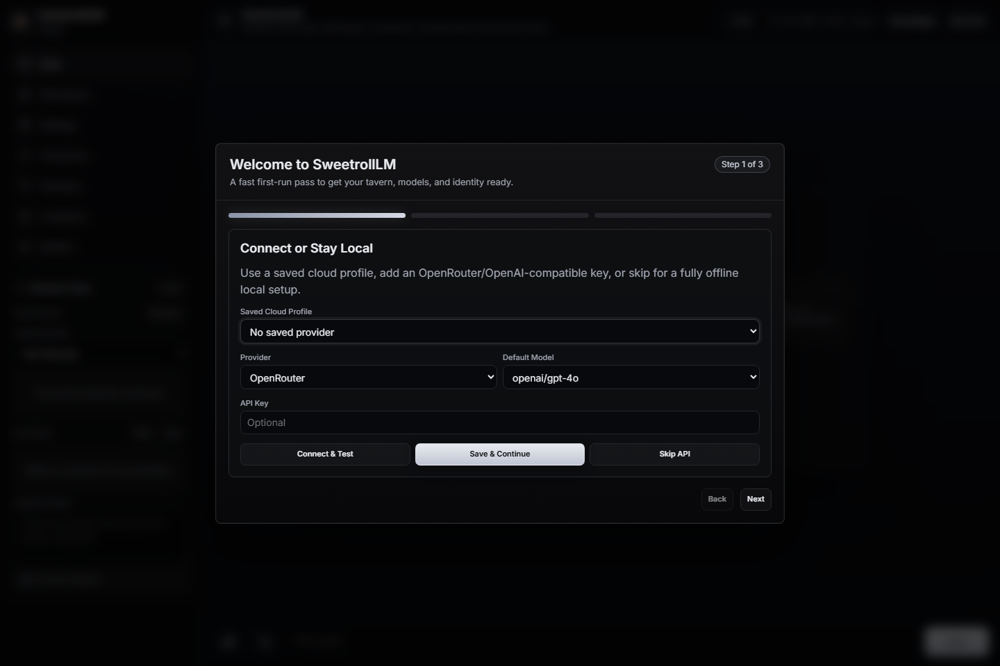

<p align="center"></p>

# SweetrollLM

> A local-first AI tavern for character chat, GGUF inference, cloud providers, multimodal context, and a growing agentic workspace.

SweetrollLM blends the character-card and lorebook comfort of SillyTavern with the model-management feel of LM Studio and the focused workspace ergonomics of modern agentic tools. It is built to run from your machine, store user data locally, and gracefully route between native GGUF inference, an embedded KoboldCPP old-PC worker, and OpenAI-compatible cloud APIs.

## Screenshots & Media

### First-Run Setup Wizard



### Future Gallery Slots

Drop additional project media here as the UI evolves:

- `docs/screenshots/character-chat.png` - character chat with avatar backdrop and gallery.
- `docs/screenshots/home-after-setup.png` - default chat screen after onboarding.
- `docs/screenshots/workspace-agent.png` - Agentic Workspace running a file or terminal task.
- `docs/screenshots/model-marketplace.png` - GGUF marketplace and local model manager.
- `docs/media/demo-chat-flow.gif` - chat-native image attachment and auto-summary flow.
- `docs/media/workspace-demo.mp4` - workspace automation or coding session walkthrough.

## What Makes It Different

### Adaptive Inference Routing

SweetrollLM attempts native `llama-cpp-python` loading first for modern machines. If the local wheel fails because of AVX/AVX2 or binary instruction mismatch, the backend catches the failure and can launch `koboldcpp-oldpc.exe` headlessly as a managed background worker.

The user sees a clean diagnostic instead of a crash.

### Secure Multi-API Provider Slots

Cloud provider profiles are stored locally under `storage/`, with each profile isolated by its own ID, base URL, model, default flag, and fallback flag.

The browser no longer receives raw API keys from the provider registry. Saved keys are masked in the UI and resolved server-side only when a selected provider profile is used.

### Chat-Native Image Attachments

Image attachment now behaves like a modern AI chat client:

- Attach an image directly in the chat composer.
- Add optional text such as "this is me" or "look at this screenshot."
- Press Send once.
- SweetrollLM uploads the image locally, captions it through the configured vision profile, injects the caption as hidden visual context for that turn, and keeps the visible chat immersive with the image inline.

The same image attachment pattern is available in the Agentic Workspace composer for screenshot analysis and workspace debugging.

### Per-Chat Summary Memory

Each character chat can carry its own continuity summary.

- Write a long summary manually in Chat Settings.
- Generate one from the last N messages.
- Enable Auto Summary so the chat refreshes its memory after new assistant replies.
- Keep lorebook/persona overrides isolated per timeline.

This keeps long-running roleplay and project chats coherent without forcing users to constantly reopen settings.

### Character Chat Gallery

Every character chat now has a lightweight gallery in Chat Settings. Images sent in that timeline are collected automatically from message history so users can revisit visual context without digging through the full conversation.

### Dual-Layer Backdrop System

SweetrollLM supports a hierarchical background engine:

1. Character card backdrop.
2. Character avatar fallback.
3. Uploaded global chat background.
4. Theme default canvas.

Message bubble transparency and background image opacity are controlled independently through CSS variables, so the art can stay visible without reducing text readability.

### Agentic Workspace

The workspace lives as its own app section and operates inside `./workspace`.

It supports:

- Folder-aware workspace chat sessions.
- Ask-first, read-only, and full-access control levels.
- File and folder tools with sandbox path validation.
- Terminal command execution.
- Background service management.
- Automation script execution.
- Workspace image attachments for screenshot analysis.
- Context flush and thread pruning.

The goal is a practical local agent workspace that can inspect, create, run, and repair files while keeping SweetrollLM's roleplay chat surface intact.

## Installation

### 1. Clone

```bash
git clone https://github.com/syfr512/SweetrollLM.git
cd SweetrollLM
```

### 2. Install

Run once:

```text
install.bat
```

This creates `venv/` and installs the Python dependencies.

### 3. Launch

Run:

```text
start.bat
```

SweetrollLM opens at:

```text
http://127.0.0.1:7865
```

### 4. Optional Desktop Shortcut

Run:

```text
create_shortcut.bat
```

This creates a Windows Desktop shortcut mapped to `start.bat` and uses the bundled `sweetroll_lm/static/assets/icon.ico` icon.

## Local Models

Place `.gguf` files in:

```text
storage/models/
```

For legacy CPUs without modern vector extensions, place:

```text
koboldcpp-oldpc.exe
```

in the project root. SweetrollLM will use it only when native loading fails or when the managed fallback route is needed.

## Local Data Layout

Runtime data is intentionally local and ignored by Git:

- `storage/api_providers.json`
- `storage/app_settings.json`
- `storage/characters/`
- `storage/chats/`
- `storage/lorebooks/`
- `storage/personas/`
- `storage/assets/`
- `storage/models/`
- `storage/workspace_chats/`
- `workspace/`

The repository ships only placeholder `.gitkeep` files for these folders. User cards, API keys, chats, assets, logs, models, and workspace files should not be committed.

## Feature Overview

- Streaming chat through Server-Sent Events.
- Optional non-streamed full response mode.
- Character cards with import/export support.
- Personas with default persona selection.
- Lorebooks with active/inactive controls.
- Per-chat persona/lorebook overrides.
- Per-chat manual summary and Auto Summary.
- Character chat gallery.
- Direct chat image attachments with vision captioning.
- Workspace image attachments for screenshots.
- OpenAI-compatible provider registry.
- Provider-specific image generation and vision caption configuration.
- Local GGUF model scanner and inline loader.
- Hugging Face GGUF marketplace and background downloader.
- Native-to-KoboldCPP fallback routing.
- Live console log viewer.
- App-mode Windows launcher.

## Development Checks

Before committing:

```bash
node --check sweetroll_lm/static/js/app.js
python -m compileall sweetroll_lm test_architecture.py
python test_architecture.py
```

Expected architecture result:

```text
Overall: PASS
```

## License

SweetrollLM is released under the GNU Affero General Public License v3.0.

Build with it, fork it, modify it, share it, and keep derivative networked versions open for the community.
